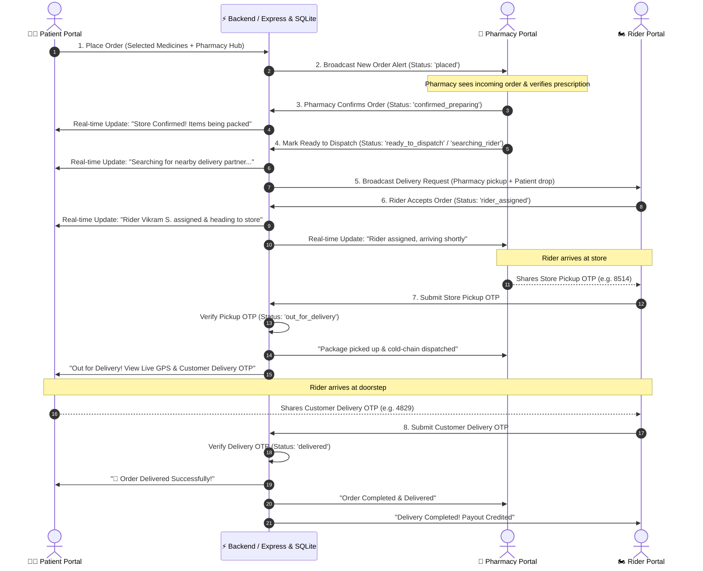

# Implementation Plan: Connect Patient, Pharmacy & Rider Portals in End-to-End Order-to-Delivery Sequence

Connect the **Patient Portal**, **Pharmacy Store Portal**, and **Delivery Rider Portal** into a synchronized, real-time Quick-Commerce style ordering and delivery pipeline (inspired by rapid delivery quick-commerce patterns with cold-chain compliance and 2-step OTP verification).

---

## User Review Required

> [!IMPORTANT]
> **Key Architectural Highlights**:
> 1. **Persistent & Synchronized Order Lifecycle**: Orders will be backed by SQLite DB and active polling/event sync so that when an action is taken on one portal (e.g. Patient places order, Pharmacy confirms & prepares, Rider accepts, Rider verifies pickup OTP, Rider verifies customer delivery OTP), all portals reflect the status immediately without page reloads.
> 2. **2-Step OTP Security Protocol**:
>    - **Step 1 (Pharmacy ↔ Rider Handover)**: Pharmacy portal displays the 4-digit **Store Pickup OTP** (e.g., `8514`). The rider must enter this OTP on their portal to confirm cold-chain handover from the pharmacist before departing.
>    - **Step 2 (Rider ↔ Patient Handover)**: Patient portal displays their unique 4-digit **Customer Delivery OTP** (e.g., `4829`). The rider must obtain and verify this OTP from the patient at doorstep to confirm successful delivery.
> 3. **Interactive Multi-Role Switcher & Live Pipeline Tracker**:
>    - A dedicated top role quick-switch toolbar will allow instant 1-click toggling between **👩‍💼 Patient View**, **🏥 Pharmacy View**, **🏍️ Rider View**, and **👑 Admin/Owner View** so that testing and experiencing the whole flow in action is seamless.

---

## Order-to-Delivery Lifecycle Workflow

---

## Proposed Changes

### 1. Backend & Database Layer

#### [MODIFY] [server/db.ts](file:///d:/quickmed-explainer/server/db.ts)
- Update SQLite database schema to ensure `orders` table includes full fulfillment fields:
  - `id`, `patient_id`, `patient_name`, `patient_phone`, `patient_address`
  - `pharmacy_id`, `pharmacy_name`, `pharmacy_address`, `pharmacy_phone`
  - `rider_id`, `rider_name`, `rider_phone`, `rider_vehicle`
  - `items_json`, `total_amount`, `delivery_fee`, `is_emergency`
  - `status` (`placed`, `confirmed_preparing`, `ready_to_dispatch`, `searching_rider`, `rider_assigned`, `picked_up`, `out_for_delivery`, `delivered`, `cancelled`)
  - `pickup_otp` (4-digit code generated for pharmacy pickup handover)
  - `delivery_otp` (4-digit code generated for customer delivery verification)
  - `timeline_json` (audit logs of all timestamps: placedAt, confirmedAt, readyAt, acceptedAt, pickedUpAt, deliveredAt)
  - `created_at`, `updated_at`
- Add schema migration script to ensure existing columns are added seamlessly without data loss.

#### [MODIFY] [shared/schemas.ts](file:///d:/quickmed-explainer/shared/schemas.ts)
- Add Zod schemas:
  - `CreateOrderSchema` (patient ID, items list, pharmacy ID, total amount, emergency flag, address)
  - `UpdateOrderStatusSchema` (status transition validation)
  - `VerifyPickupOtpSchema` (orderId, pickupOtp)
  - `VerifyDeliveryOtpSchema` (orderId, deliveryOtp)
- Export strong TypeScript interfaces.

#### [MODIFY] [server/routes.ts](file:///d:/quickmed-explainer/server/routes.ts)
- Implement REST API endpoints:
  - `POST /api/orders`: Create new order, generate 4-digit pickup OTP & delivery OTP, initialize timeline.
  - `GET /api/orders`: Query orders with optional filtering (`role`, `patientId`, `pharmacyId`, `riderId`, `status`).
  - `GET /api/orders/:id`: Get full details and status of an order.
  - `PATCH /api/orders/:id/status`: Transition order status (with role authorization).
  - `POST /api/orders/:id/assign-rider`: Assign rider to the order.
  - `POST /api/orders/:id/verify-pickup-otp`: Validate pharmacy store pickup OTP.
  - `POST /api/orders/:id/verify-delivery-otp`: Validate patient doorstep delivery OTP.
  - `POST /api/orders/:id/reset-demo`: Reset demo orders for easy testing.

---

### 2. Frontend State & Shared Context

#### [MODIFY] [client/src/contexts/AuthContext.tsx](file:///d:/quickmed-explainer/client/src/contexts/AuthContext.tsx)
- Add active order management and synchronized state:
  - `activeOrders`: List of active orders in the system.
  - `currentOrder`: Selected/latest active order.
  - `placeOrder`: Method to place order and save to backend.
  - `confirmOrder`: Method for pharmacy to confirm & pack order.
  - `markReadyToDispatch`: Method for pharmacy to set ready and trigger rider search.
  - `acceptRiderOrder`: Method for rider to accept the delivery.
  - `verifyPickupOtp`: Method for rider to submit pickup OTP.
  - `verifyDeliveryOtp`: Method for rider to submit delivery OTP.
  - `quickSwitchRole`: Seamless 1-click role switcher helper for easy evaluation.
  - Real-time polling (every 2.5s) to ensure synchronization between open tabs / roles.

---

### 3. Patient, Pharmacy & Rider UI Enhancements

#### [MODIFY] [client/src/pages/MedicineMVP.tsx](file:///d:/quickmed-explainer/client/src/pages/MedicineMVP.tsx)
- **Top Bar**:
  - Add an intuitive **Interactive Quick Role Switcher** with badges:
    `[👩‍💼 Patient View] | [🏥 Pharmacy View (Apollo Hub)] | [🏍️ Rider View (Vikram S.)]`
  - Add an **Order Status Live Pill** in the header displaying current active order state with pulsing indicator.
- **Patient Portal (`ocr` & `dispatch` & `delivery` tabs)**:
  - Order Placement: Clicking "Confirm Order" creates a real order in the backend database.
  - Instantly switches to the **Live Order-to-Delivery Tracker**:
    - Step 1: "Order Placed & Awaiting Store Confirmation"
    - Step 2: "Pharmacy Confirmed & Preparing Medicines (Insulated cold-chain pack)"
    - Step 3: "Searching for Express Delivery Partner (Radar animation)"
    - Step 4: "Rider Assigned (Vikram Singh heading to Pharmacy)"
    - Step 5: "Package Picked Up from Pharmacy & Out for Delivery" (Live GPS route map & Patient Delivery OTP card `4829`)
    - Step 6: "Delivered & Verified" (Celebration & order summary)
- **Pharmacy Portal (`verification` & `dispatch` & `customer-orders` tabs)**:
  - **Incoming Live Orders Section**:
    - Alerts pharmacy when a new order arrives for their store.
    - Shows medicines list, patient delivery address, cold-chain alert.
    - Button: **"Confirm & Start Packing"** -> updates status.
    - Button: **"Mark Ready for Dispatch"** -> updates status and notifies system to search for rider.
    - Displays the **Store Pickup OTP** (`8514`) with instruction: *"Share this code with rider Vikram Singh upon arrival for cold-chain handover"*.
    - Shows real-time rider status ("Rider en route to store", "Rider arrived", "Package handed over").
- **Rider Portal (`delivery` & `rider-history` tabs)**:
  - **Incoming Order Alert Modal/Card**:
    - Appears when order is ready for dispatch: Shows pickup store name & distance, drop address, payout (₹65), and **"Accept Delivery Order"** action.
  - **2-Step Verification Workflow**:
    - **Step 1**: Arrive at Pharmacy Store -> Enter Store Pickup OTP (`8514`) -> Click "Verify Store Pickup".
    - **Step 2**: Out for Delivery to Patient -> Arrive at Patient Doorstep -> Enter Patient OTP (`4829`) -> Click "Verify & Complete Delivery".
    - Displays live route navigation, patient contact, earnings bump.

---

### 4. Interactive Live Preview & Quick Demo Showcase Mode

#### [NEW] [client/src/components/LiveOrderDemoModal.tsx](file:///d:/quickmed-explainer/client/src/components/LiveOrderDemoModal.tsx)
- A dedicated **"⚡ Live Demo & Multi-Portal Preview"** modal accessible from anywhere with 1 click in the top header:
  - **Split-View Multi-Role Screen**: Displays all 3 parties side-by-side on desktop (or tabbed/stepped on mobile):
    - **Col 1 (Patient)**: Order placement, live tracking, Customer Delivery OTP card (`4829`).
    - **Col 2 (Pharmacy Hub)**: Incoming order notification, prescription verification, packaging, Store Pickup OTP (`8514`).
    - **Col 3 (Rider Courier)**: Delivery dispatch alert, acceptance, 2-step OTP verification inputs, cold chain telemetry.
  - **Auto-Play Simulation / Interactive Stepper**:
    - **"▶ Play Auto-Demo"**: Automatically runs through the entire sequence with smooth animations (5-10 seconds per stage) so anyone watching gets an instant WOW factor understanding of how the whole platform works.
    - **"Interactive Mode"**: Allows the presenter to click through each stage manually or test specific edge cases (invalid OTP, emergency priority, temperature alerts).
    - **"Reset Simulation"**: Instantly resets to initial state for repeat demonstrations.

---

## Verification Plan

### Automated Tests
- TypeScript type check: `npm.cmd run check`
- Backend API tests using Node test script to verify:
  - Order creation
  - Pharmacy status transitions
  - Pickup OTP validation (reject incorrect, accept correct)
  - Delivery OTP validation (reject incorrect, accept correct)

### Manual Browser Verification
- Using Browser subagent:
  1. Open application in browser at `http://localhost:3000`.
  2. As Patient, place an order with selected pharmacy (e.g. Apollo Pharmacy).
  3. Switch to Pharmacy Portal: Verify incoming order is received with patient details, click "Confirm Order", then "Mark Ready for Dispatch".
  4. Switch to Rider Portal: Verify delivery request appears, click "Accept Delivery Order".
  5. As Rider, test entering invalid Pickup OTP (verify error toast), then enter correct Store Pickup OTP (verify success & status changes to Out for Delivery).
  6. As Patient, verify Out for Delivery tracking and Delivery OTP is visible.
  7. As Rider, enter correct Delivery OTP (verify success & status changes to Delivered).
  8. Verify all 3 portals show the completed delivery status.
